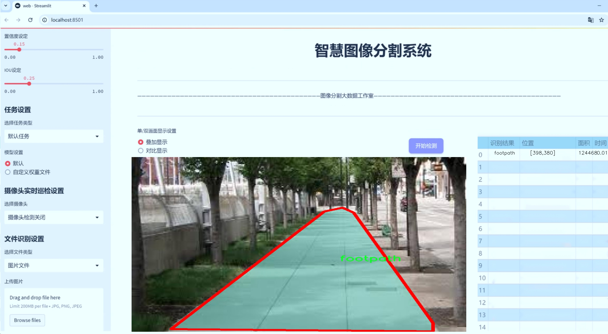
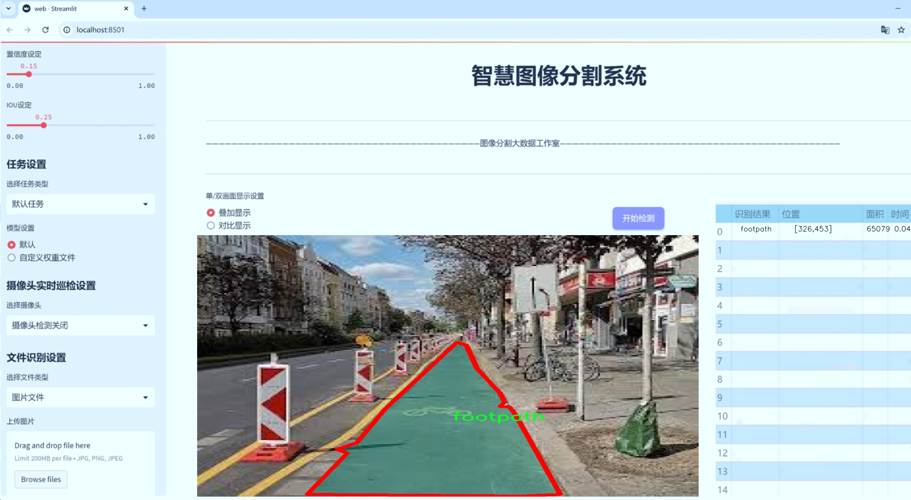
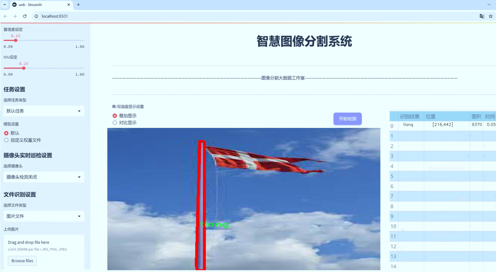
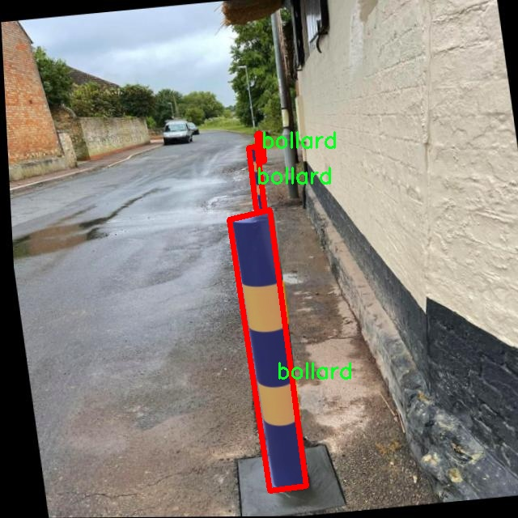
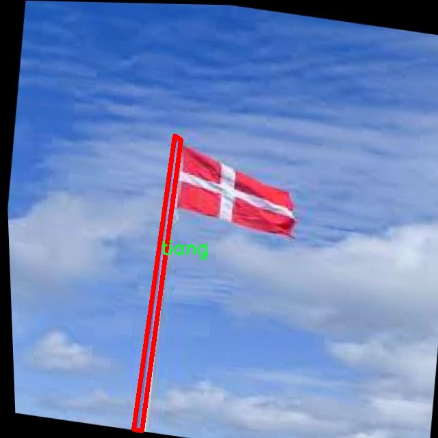
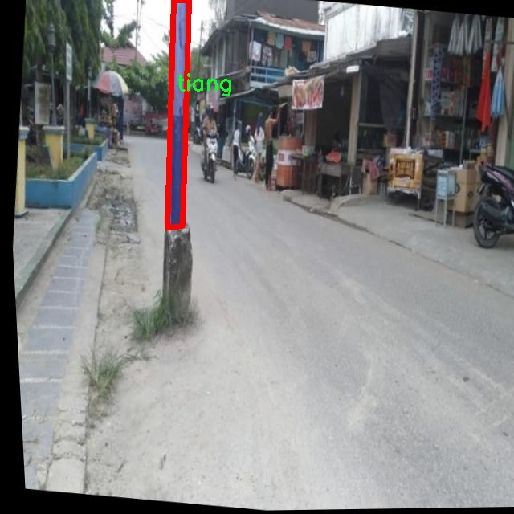
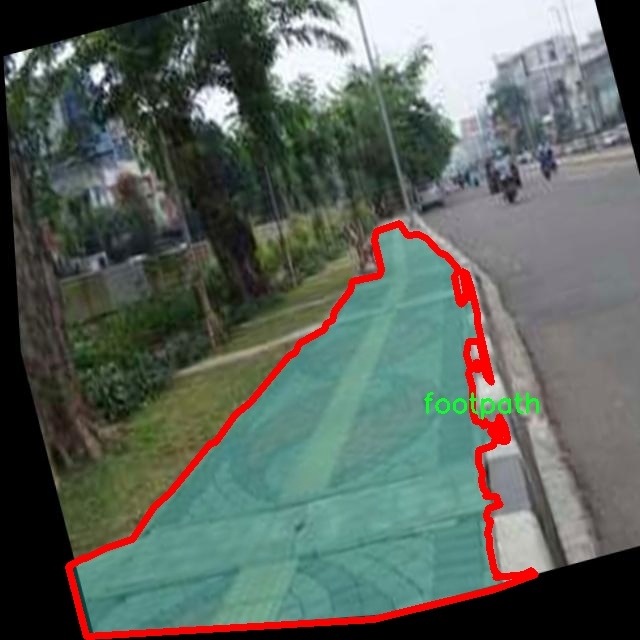
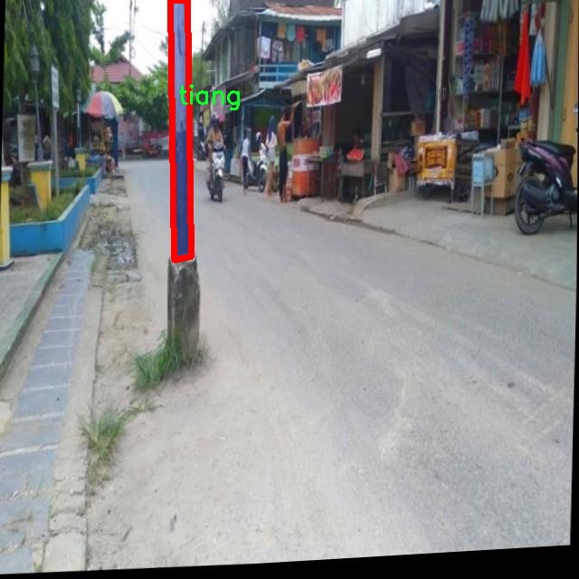

# 盲道类型识别人行道分割障碍物识别系统源码＆数据集分享
 [yolov8-seg-dyhead＆yolov8-seg-timm等50+全套改进创新点发刊_一键训练教程_Web前端展示]

### 1.研究背景与意义

项目参考[ILSVRC ImageNet Large Scale Visual Recognition Challenge](https://gitee.com/YOLOv8_YOLOv11_Segmentation_Studio/projects)

项目来源[AAAI Global Al lnnovation Contest](https://kdocs.cn/l/cszuIiCKVNis)

研究背景与意义

随着城市化进程的加快，城市交通系统的复杂性日益增加，行人安全问题逐渐成为社会关注的焦点。特别是在城市人行道的设计与管理中，如何有效识别和分割行人道上的障碍物，确保行人安全通行，成为亟待解决的技术难题。近年来，计算机视觉技术的快速发展为这一问题提供了新的解决方案。尤其是基于深度学习的目标检测与分割技术，已在多个领域展现出优越的性能。其中，YOLO（You Only Look Once）系列模型因其高效的实时处理能力和良好的检测精度，成为目标检测领域的研究热点。

本研究旨在基于改进的YOLOv8模型，构建一个针对盲道类型的人行道分割与障碍物识别系统。该系统将有效提升城市人行道的智能化管理水平，确保行人特别是视障人士的安全出行。为实现这一目标，我们将使用“footpath-segmentation”数据集，该数据集包含1700幅图像，涵盖了6个类别的目标，包括路障（bollard）、人行道（footpath）、前进标志（go）、已到达标志（got）、停止标志（stop）和灯柱（tiang）。这些类别的设置不仅反映了人行道的基本构成要素，也为障碍物的识别提供了丰富的样本。

在研究过程中，我们将对YOLOv8模型进行改进，以适应特定的场景需求。通过引入新的数据增强技术和改进的损失函数，提升模型在复杂环境下的鲁棒性和准确性。同时，针对数据集中不同类别的特征，我们将设计多层次的特征提取模块，以增强模型对细小障碍物的识别能力。这些改进将使得系统在实际应用中，能够实时识别和分割人行道上的各种障碍物，为行人提供更为安全的通行环境。

本研究的意义不仅在于技术层面的创新，更在于其对社会的积极影响。通过构建高效的障碍物识别系统，我们能够为城市交通管理提供数据支持，帮助相关部门及时处理人行道上的障碍物，改善行人通行条件。此外，该系统还可为视障人士提供辅助导航服务，提升他们的出行安全感和便利性。随着智能城市理念的推广，基于计算机视觉的行人道管理系统将成为未来城市交通管理的重要组成部分。

综上所述，基于改进YOLOv8的盲道类型识别人行道分割障碍物识别系统的研究，不仅具有重要的学术价值，也具备广泛的应用前景。通过深入探讨这一领域，我们希望为实现更安全、更智能的城市交通环境贡献一份力量。

### 2.图片演示







##### 注意：由于此博客编辑较早，上面“2.图片演示”和“3.视频演示”展示的系统图片或者视频可能为老版本，新版本在老版本的基础上升级如下：（实际效果以升级的新版本为准）

  （1）适配了YOLOV8的“目标检测”模型和“实例分割”模型，通过加载相应的权重（.pt）文件即可自适应加载模型。

  （2）支持“图片识别”、“视频识别”、“摄像头实时识别”三种识别模式。

  （3）支持“图片识别”、“视频识别”、“摄像头实时识别”三种识别结果保存导出，解决手动导出（容易卡顿出现爆内存）存在的问题，识别完自动保存结果并导出到tempDir中。

  （4）支持Web前端系统中的标题、背景图等自定义修改，后面提供修改教程。

  另外本项目提供训练的数据集和训练教程,暂不提供权重文件（best.pt）,需要您按照教程进行训练后实现图片演示和Web前端界面演示的效果。

### 3.视频演示

[3.1 视频演示](https://www.bilibili.com/video/BV1bv1GYqEiN/)

### 4.数据集信息展示

##### 4.1 本项目数据集详细数据（类别数＆类别名）

nc: 5
names: ['bollard', 'footpath', 'go', 'stop', 'tiang']


##### 4.2 本项目数据集信息介绍

数据集信息展示

在本研究中，我们采用了名为“footpath-segmentation”的数据集，以支持对盲道类型的识别和人行道分割障碍物的识别系统的训练与改进。该数据集专门设计用于提高YOLOv8-seg模型在复杂环境中对不同类型障碍物的识别能力，尤其是在城市街道和人行道场景中。数据集的构建考虑到了多样性和代表性，确保其能够有效反映现实世界中人行道的各种情况。

“footpath-segmentation”数据集包含五个主要类别，分别是：bollard（路障）、footpath（人行道）、go（前进标志）、stop（停车标志）和tiang（灯柱）。这些类别的选择不仅涵盖了人行道上的常见元素，还包括了行人和交通的相关指示标志，旨在提供一个全面的环境背景，以便于模型在进行分割和识别时能够获得丰富的上下文信息。

首先，路障（bollard）作为人行道中常见的障碍物，主要用于引导交通和保护行人安全。该类别的样本在数据集中占据了重要位置，确保模型能够准确识别并分割出这些障碍物，以避免在行人通行时造成潜在的危险。其次，人行道（footpath）作为数据集的核心类别，提供了背景信息，帮助模型理解行人通行的主要区域，进而提高整体识别的准确性。

此外，数据集中还包含了“go”和“stop”这两个标志类别。这些标志在城市环境中起着至关重要的作用，指引行人和车辆的行为。通过对这些标志的识别，模型不仅能够提升对人行道的理解，还能在更高层次上支持智能交通系统的应用。这一方面使得模型在处理复杂的交通场景时，能够做出更为精准的判断，另一方面也为后续的应用提供了更为丰富的数据基础。

最后，灯柱（tiang）作为另一个重要的类别，虽然在行人道上并不总是显眼，但其存在却对行人和车辆的安全有着不可忽视的影响。通过对灯柱的识别，模型能够更全面地理解人行道的环境布局，从而在进行障碍物识别时，减少误判和漏判的情况。

综上所述，“footpath-segmentation”数据集不仅涵盖了多样的类别，还通过精心设计的样本，使得模型在训练过程中能够接触到丰富的场景变化和障碍物特征。这一数据集的使用，将极大地提升YOLOv8-seg模型在盲道类型识别和人行道分割障碍物识别任务中的表现，为实现更安全、更智能的城市交通环境奠定了坚实的基础。通过不断优化和调整模型，我们期望能够在实际应用中，提供更加高效和准确的识别系统，进而推动智能交通技术的发展。











### 5.全套项目环境部署视频教程（零基础手把手教学）

[5.1 环境部署教程链接（零基础手把手教学）](https://www.bilibili.com/video/BV1jG4Ve4E9t/?vd_source=bc9aec86d164b67a7004b996143742dc)


[5.2 安装Python虚拟环境创建和依赖库安装视频教程链接（零基础手把手教学）](https://www.bilibili.com/video/BV1nA4VeYEze/?vd_source=bc9aec86d164b67a7004b996143742dc)

### 6.手把手YOLOV8-seg训练视频教程（零基础小白有手就能学会）

[6.1 手把手YOLOV8-seg训练视频教程（零基础小白有手就能学会）](https://www.bilibili.com/video/BV1cA4VeYETe/?vd_source=bc9aec86d164b67a7004b996143742dc)


按照上面的训练视频教程链接加载项目提供的数据集，运行train.py即可开始训练



     Epoch   gpu_mem       box       obj       cls    labels  img_size
     1/200     0G   0.01576   0.01955  0.007536        22      1280: 100%|██████████| 849/849 [14:42<00:00,  1.04s/it]
               Class     Images     Labels          P          R     mAP@.5 mAP@.5:.95: 100%|██████████| 213/213 [01:14<00:00,  2.87it/s]
                 all       3395      17314      0.994      0.957      0.0957      0.0843

     Epoch   gpu_mem       box       obj       cls    labels  img_size
     2/200     0G   0.01578   0.01923  0.007006        22      1280: 100%|██████████| 849/849 [14:44<00:00,  1.04s/it]
               Class     Images     Labels          P          R     mAP@.5 mAP@.5:.95: 100%|██████████| 213/213 [01:12<00:00,  2.95it/s]
                 all       3395      17314      0.996      0.956      0.0957      0.0845

     Epoch   gpu_mem       box       obj       cls    labels  img_size
     3/200     0G   0.01561    0.0191  0.006895        27      1280: 100%|██████████| 849/849 [10:56<00:00,  1.29it/s]
               Class     Images     Labels          P          R     mAP@.5 mAP@.5:.95: 100%|███████   | 187/213 [00:52<00:00,  4.04it/s]
                 all       3395      17314      0.996      0.957      0.0957      0.0845


### 7.50+种全套YOLOV8-seg创新点代码加载调参视频教程（一键加载写好的改进模型的配置文件）

[7.1 50+种全套YOLOV8-seg创新点代码加载调参视频教程（一键加载写好的改进模型的配置文件）](https://www.bilibili.com/video/BV1Hw4VePEXv/?vd_source=bc9aec86d164b67a7004b996143742dc)

### 8.YOLOV8-seg图像分割算法原理

原始YOLOv8-seg算法原理

YOLOv8-seg算法是YOLO系列中的最新版本，结合了目标检测与图像分割的功能，旨在提升计算机视觉任务的效率与准确性。该算法的设计理念是通过对输入图像进行高效的特征提取与处理，来实现对目标的精确定位和分割。YOLOv8-seg的架构主要由Backbone、Neck和Head三个部分组成，这些部分相互协作，共同完成图像的分析与处理。

在Backbone部分，YOLOv8-seg采用了CSPDarknet网络结构，这是一种经过优化的深度学习模型，能够有效提取图像中的特征。CSPDarknet通过将输入特征图分为两个分支，并在每个分支中使用多个残差块，来增强模型的特征学习能力。相较于前代模型，YOLOv8-seg引入了C2f模块，替代了传统的C3模块。C2f模块的设计使得特征图在经过卷积层降维后，能够形成更高维度的特征表示，这一过程通过堆叠多个分支实现，从而提高了梯度流的信息传递能力。此外，YOLOv8-seg还引入了快速空间金字塔池化（SPPF）结构，以处理不同尺度的特征。这一结构的优势在于，它能够有效减少模型的参数量和计算量，同时提升特征提取的效率，为后续的目标检测和分割提供了坚实的基础。

在Neck部分，YOLOv8-seg利用特征金字塔网络（FPN）和路径聚合网络（PAN）相结合的结构，进一步融合不同尺度的特征图信息。FPN的引入使得模型能够更好地处理多尺度目标，而PAN则通过多层卷积和池化操作，有效压缩特征图的维度，提升了信息的传递效率。这一阶段的设计不仅增强了特征的表达能力，还为后续的目标检测和分割提供了丰富的信息支持。

进入Head部分，YOLOv8-seg采用了解耦的检测头结构，分别处理目标的回归和分类任务。通过两个并行的卷积分支，模型能够独立计算目标的中心点、宽高比例以及类别信息。这种设计的优点在于，能够有效减少计算复杂度，同时提高检测的准确性。此外，YOLOv8-seg引入了无锚框（Anchor-Free）检测方式，直接预测目标的中心点和尺寸，避免了传统锚框方法的局限性，从而提升了检测速度和准确度。

在实际应用中，YOLOv8-seg的高效性和准确性使其在多个领域中展现出广泛的应用潜力。例如，在农业领域，YOLOv8-seg可以用于自动化的苹果采摘，通过视觉识别技术自动检测和定位成熟的苹果。这一过程不仅提高了采摘效率，还减少了人工成本。此外，结合蚁群算法进行路径规划，能够使自动采摘机器人在复杂的果园环境中高效移动，进一步提升了作业的智能化水平。

总的来说，YOLOv8-seg算法通过其创新的网络结构和高效的特征提取机制，成功地将目标检测与图像分割相结合，开创了计算机视觉领域的新局面。其在准确性、速度和灵活性方面的显著提升，为未来的研究和应用提供了广阔的前景。随着YOLOv8-seg的不断发展与完善，预计将会在更多实际场景中发挥重要作用，推动智能化技术的进步与应用。


### 9.系统功能展示（检测对象为举例，实际内容以本项目数据集为准）

图9.1.系统支持检测结果表格显示

  图9.2.系统支持置信度和IOU阈值手动调节

  图9.3.系统支持自定义加载权重文件best.pt(需要你通过步骤5中训练获得)

  图9.4.系统支持摄像头实时识别

  图9.5.系统支持图片识别

  图9.6.系统支持视频识别

  图9.7.系统支持识别结果文件自动保存

  图9.8.系统支持Excel导出检测结果数据


### 10.50+种全套YOLOV8-seg创新点原理讲解（非科班也可以轻松写刊发刊，V11版本正在科研待更新）

#### 10.1 由于篇幅限制，每个创新点的具体原理讲解就不一一展开，具体见下列网址中的创新点对应子项目的技术原理博客网址【Blog】：


[10.1 50+种全套YOLOV8-seg创新点原理讲解链接](https://gitee.com/qunmasj/good)

#### 10.2 部分改进模块原理讲解(完整的改进原理见上图和技术博客链接)【如果此小节的图加载失败可以通过CSDN或者Github搜索该博客的标题访问原始博客，原始博客图片显示正常】
### FasterNet简介
神经网络在图像分类、检测和分割等各种计算机视觉任务中经历了快速发展。尽管其令人印象深刻的性能为许多应用程序提供了动力，但一个巨大的趋势是追求具有低延迟和高吞吐量的快速神经网络，以获得良好的用户体验、即时响应和安全原因等。

如何快速？研究人员和从业者不需要更昂贵的计算设备，而是倾向于设计具有成本效益的快速神经网络，降低计算复杂度，主要以浮点运算（FLOPs）的数量来衡量。

MobileNet、ShuffleNet和GhostNet等利用深度卷积（DWConv）和/或组卷积（GConv）来提取空间特征。然而，在减少FLOPs的过程中，算子经常会受到内存访问增加的副作用的影响。MicroNet进一步分解和稀疏网络，将其FLOPs推至极低水平。尽管这种方法在FLOPs方面有所改进，但其碎片计算效率很低。此外，上述网络通常伴随着额外的数据操作，如级联、Shuffle和池化，这些操作的运行时间对于小型模型来说往往很重要。

除了上述纯卷积神经网络（CNNs）之外，人们对使视觉Transformer（ViTs）和多层感知器（MLP）架构更小更快也越来越感兴趣。例如，MobileViT和MobileFormer通过将DWConv与改进的注意力机制相结合，降低了计算复杂性。然而，它们仍然受到DWConv的上述问题的困扰，并且还需要修改的注意力机制的专用硬件支持。使用先进但耗时的标准化和激活层也可能限制其在设备上的速度。

所有这些问题一起导致了以下问题：这些“快速”的神经网络真的很快吗？为了回答这个问题，作者检查了延迟和FLOPs之间的关系，这由


其中FLOPS是每秒浮点运算的缩写，作为有效计算速度的度量。虽然有许多减少FLOPs的尝试，但都很少考虑同时优化FLOPs以实现真正的低延迟。为了更好地理解这种情况，作者比较了Intel CPU上典型神经网络的FLOPS。


图中的结果表明，许多现有神经网络的FLOPS较低，其FLOPS通常低于流行的ResNet50。由于FLOPS如此之低，这些“快速”的神经网络实际上不够快。它们的FLOPs减少不能转化为延迟的确切减少量。在某些情况下，没有任何改善，甚至会导致更糟的延迟。例如，CycleMLP-B1具有ResNet50的一半FLOPs，但运行速度较慢（即CycleMLPB1与ResNet50:111.9ms与69.4ms）。

请注意，FLOPs与延迟之间的差异在之前的工作中也已被注意到，但由于它们采用了DWConv/GConv和具有低FLOPs的各种数据处理，因此部分问题仍未解决。人们认为没有更好的选择。

该博客提供的方案通过开发一种简单、快速、有效的运算符来消除这种差异，该运算符可以在减少FLOPs的情况下保持高FLOPS。

具体来说，作者重新审视了现有的操作符，特别是DWConv的计算速度——FLOPS。作者发现导致低FLOPS问题的主要原因是频繁的内存访问。然后，作者提出了PConv作为一种竞争性替代方案，它减少了计算冗余以及内存访问的数量。

图1说明了PConv的设计。它利用了特征图中的冗余，并系统地仅在一部分输入通道上应用规则卷积（Conv），而不影响其余通道。本质上，PConv的FLOPs低于常规Conv，而FLOPs高于DWConv/GConv。换句话说，PConv更好地利用了设备上的计算能力。PConv在提取空间特征方面也很有效，这在本文后面的实验中得到了验证。

作者进一步引入PConv设计了FasterNet作为一个在各种设备上运行速度非常快的新网络家族。特别是，FasterNet在分类、检测和分割任务方面实现了最先进的性能，同时具有更低的延迟和更高的吞吐量。例如，在GPU、CPU和ARM处理器上，小模型FasterNet-T0分别比MobileVitXXS快3.1倍、3.1倍和2.5倍，而在ImageNet-1k上的准确率高2.9%。大模型FasterNet-L实现了83.5%的Top-1精度，与Swin-B不相上下，同时在GPU上提供了49%的高吞吐量，在CPU上节省了42%的计算时间。

总之，贡献如下：

指出了实现更高FLOPS的重要性，而不仅仅是为了更快的神经网络而减少FLOPs。

引入了一种简单但快速且有效的卷积PConv，它很有可能取代现有的选择DWConv。

推出FasterNet，它在GPU、CPU和ARM处理器等多种设备上运行良好且普遍快速。

对各种任务进行了广泛的实验，并验证了PConv和FasterNet的高速性和有效性。

### Conv和FasterNet的设计
#### 原理

DWConv是Conv的一种流行变体，已被广泛用作许多神经网络的关键构建块。对于输入，DWConv应用个滤波器来计算输出。如图（b）所示，每个滤波器在一个输入通道上进行空间滑动，并对一个输出通道做出贡献。

与具有的FLOPs常规Conv相比，这种深度计算使得DWConv仅仅具有的FLOPs。虽然在减少FLOPs方面有效，但DWConv（通常后跟逐点卷积或PWConv）不能简单地用于替换常规Conv，因为它会导致严重的精度下降。因此，在实践中，DWConv的通道数（或网络宽度）增加到＞以补偿精度下降，例如，倒置残差块中的DWConv宽度扩展了6倍。然而，这会导致更高的内存访问，这会造成不可忽略的延迟，并降低总体计算速度，尤其是对于I/O绑定设备。特别是，内存访问的数量现在上升到


它比一个常规的Conv的值要高，即，


注意，内存访问花费在I/O操作上，这被认为已经是最小的成本，很难进一步优化。

#### PConv作为一个基本的算子


在下面演示了通过利用特征图的冗余度可以进一步优化成本。如图所示，特征图在不同通道之间具有高度相似性。许多其他著作也涵盖了这种冗余，但很少有人以简单而有效的方式充分利用它。


具体而言，作者提出了一种简单的PConv，以同时减少计算冗余和内存访问。图4中的左下角说明了PConv的工作原理。它只需在输入通道的一部分上应用常规Conv进行空间特征提取，并保持其余通道不变。对于连续或规则的内存访问，将第一个或最后一个连续的通道视为整个特征图的代表进行计算。在不丧失一般性的情况下认为输入和输出特征图具有相同数量的通道。因此，PConv的FLOPs仅


对于典型的r＝1/4 ，PConv的FLOPs只有常规Conv的1/16。此外，PConv的内存访问量较小，即：


对于r＝1/4，其仅为常规Conv的1/4。

由于只有通道用于空间特征提取，人们可能会问是否可以简单地移除剩余的（c−）通道？如果是这样，PConv将退化为具有较少通道的常规Conv，这偏离了减少冗余的目标。

请注意，保持其余通道不变，而不是从特征图中删除它们。这是因为它们对后续PWConv层有用，PWConv允许特征信息流经所有通道。

#### PConv之后是PWConv


为了充分有效地利用来自所有通道的信息，进一步将逐点卷积（PWConv）附加到PConv。它们在输入特征图上的有效感受野看起来像一个T形Conv，与均匀处理补丁的常规Conv相比，它更专注于中心位置，如图5所示。为了证明这个T形感受野的合理性，首先通过计算位置的Frobenius范数来评估每个位置的重要性。


假设，如果一个职位比其他职位具有更大的Frobenius范数，则该职位往往更重要。对于正则Conv滤波器，位置处的Frobenius范数由计算，其中。


一个显著位置是具有最大Frobenius范数的位置。然后，在预训练的ResNet18中集体检查每个过滤器，找出它们的显著位置，并绘制显著位置的直方图。图6中的结果表明，中心位置是过滤器中最常见的突出位置。换句话说，中心位置的权重比周围的更重。这与集中于中心位置的T形计算一致。

虽然T形卷积可以直接用于高效计算，但作者表明，将T形卷积分解为PConv和PWConv更好，因为该分解利用了滤波器间冗余并进一步节省了FLOPs。对于相同的输入和输出，T形Conv的FLOPs可以计算为:


它高于PConv和PWConv的流量，即：


其中和（例如，当时）。此外，可以很容易地利用常规Conv进行两步实现。

# FasterNet作为Backbone
鉴于新型PConv和现成的PWConv作为主要的算子，进一步提出FasterNet，这是一个新的神经网络家族，运行速度非常快，对许多视觉任务非常有效。目标是使体系结构尽可能简单，使其总体上对硬件友好。


在图中展示了整体架构。它有4个层次级，每个层次级前面都有一个嵌入层（步长为4的常规4×4卷积）或一个合并层（步长为2的常规2×2卷积），用于空间下采样和通道数量扩展。每个阶段都有一堆FasterNet块。作者观察到，最后两个阶段中的块消耗更少的内存访问，并且倾向于具有更高的FLOPS，如表1中的经验验证。因此，放置了更多FasterNet块，并相应地将更多计算分配给最后两个阶段。每个FasterNet块有一个PConv层，后跟2个PWConv（或Conv 1×1）层。它们一起显示为倒置残差块，其中中间层具有扩展的通道数量，并且放置了Shorcut以重用输入特征。

除了上述算子，标准化和激活层对于高性能神经网络也是不可或缺的。然而，许多先前的工作在整个网络中过度使用这些层，这可能会限制特征多样性，从而损害性能。它还可以降低整体计算速度。相比之下，只将它们放在每个中间PWConv之后，以保持特征多样性并实现较低的延迟。

此外，使用批次归一化（BN）代替其他替代方法。BN的优点是，它可以合并到其相邻的Conv层中，以便更快地进行推断，同时与其他层一样有效。对于激活层，根据经验选择了GELU用于较小的FasterNet变体，而ReLU用于较大的FasterNet变体，同时考虑了运行时间和有效性。最后三个层，即全局平均池化、卷积1×1和全连接层，一起用于特征转换和分类。

为了在不同的计算预算下提供广泛的应用，提供FasterNet的Tiny模型、Small模型、Medium模型和Big模型变体，分别称为FasterNetT0/1/2、FasterNet-S、FasterNet-M和FasterNet-L。它们具有相似的结构，但深度和宽度不同。

架构规范如下：


### 11.项目核心源码讲解（再也不用担心看不懂代码逻辑）

#### 11.1 ultralytics\nn\extra_modules\kernel_warehouse.py

以下是对代码中最核心部分的分析和详细注释：

```python
import torch
import torch.nn as nn
import torch.nn.functional as F
import collections.abc
from itertools import repeat

# 解析输入参数，返回一个长度为n的列表
def parse(x, n):
    if isinstance(x, collections.abc.Iterable):
        if len(x) == 1:
            return list(repeat(x[0], n))  # 如果x的长度为1，重复n次
        elif len(x) == n:
            return x  # 如果x的长度等于n，直接返回x
        else:
            raise ValueError('length of x should be 1 or n')  # 否则抛出异常
    else:
        return list(repeat(x, n))  # 如果x不是可迭代对象，重复x n次

# 定义注意力机制类
class Attention(nn.Module):
    def __init__(self, in_planes, reduction, num_static_cell, num_local_mixture, norm_layer=nn.BatchNorm1d,
                 cell_num_ratio=1.0, nonlocal_basis_ratio=1.0, start_cell_idx=None):
        super(Attention, self).__init__()
        hidden_planes = max(int(in_planes * reduction), 16)  # 计算隐藏层的通道数
        self.kw_planes_per_mixture = num_static_cell + 1  # 每个混合物的通道数
        self.num_local_mixture = num_local_mixture  # 本地混合物的数量
        self.kw_planes = self.kw_planes_per_mixture * num_local_mixture  # 总通道数

        # 计算本地和非本地单元的数量
        self.num_local_cell = int(cell_num_ratio * num_local_mixture)
        self.num_nonlocal_cell = num_static_cell - self.num_local_cell
        self.start_cell_idx = start_cell_idx

        # 定义层
        self.avgpool = nn.AdaptiveAvgPool1d(1)  # 自适应平均池化
        self.fc1 = nn.Linear(in_planes, hidden_planes, bias=(norm_layer is not nn.BatchNorm1d))  # 全连接层
        self.norm1 = norm_layer(hidden_planes)  # 归一化层
        self.act1 = nn.ReLU(inplace=True)  # 激活函数

        # 定义映射到单元的层
        if nonlocal_basis_ratio >= 1.0:
            self.map_to_cell = nn.Identity()  # 直接映射
            self.fc2 = nn.Linear(hidden_planes, self.kw_planes, bias=True)  # 全连接层
        else:
            self.map_to_cell = self.map_to_cell_basis  # 使用基函数映射
            self.num_basis = max(int(self.num_nonlocal_cell * nonlocal_basis_ratio), 16)  # 基函数数量
            self.fc2 = nn.Linear(hidden_planes, (self.num_local_cell + self.num_basis + 1) * num_local_mixture, bias=False)
            self.fc3 = nn.Linear(self.num_basis, self.num_nonlocal_cell, bias=False)  # 非本地映射层
            self.basis_bias = nn.Parameter(torch.zeros([self.kw_planes]), requires_grad=True).float()  # 基函数偏置

        self.temp_bias = torch.zeros([self.kw_planes], requires_grad=False).float()  # 温度偏置
        self.temp_value = 0  # 温度值
        self._initialize_weights()  # 初始化权重

    def _initialize_weights(self):
        # 初始化权重
        for m in self.modules():
            if isinstance(m, nn.Linear):
                nn.init.kaiming_normal_(m.weight, mode='fan_out', nonlinearity='relu')  # Kaiming初始化
                if m.bias is not None:
                    nn.init.constant_(m.bias, 0)  # 偏置初始化为0
            if isinstance(m, nn.BatchNorm1d):
                nn.init.constant_(m.weight, 1)  # 归一化层权重初始化为1
                nn.init.constant_(m.bias, 0)  # 偏置初始化为0

    def forward(self, x):
        # 前向传播
        x = self.avgpool(x.reshape(*x.shape[:2], -1)).squeeze(dim=-1)  # 平均池化
        x = self.act1(self.norm1(self.fc1(x)))  # 通过全连接层和激活函数
        x = self.map_to_cell(self.fc2(x)).reshape(-1, self.kw_planes)  # 映射到单元
        x = x / (torch.sum(torch.abs(x), dim=1).view(-1, 1) + 1e-3)  # 归一化
        x = (1.0 - self.temp_value) * x.reshape(-1, self.kw_planes) + self.temp_value * self.temp_bias.to(x.device).view(1, -1)  # 温度调整
        return x.reshape(-1, self.kw_planes_per_mixture)[:, :-1]  # 返回结果

# 定义卷积类
class KWconvNd(nn.Module):
    def __init__(self, in_planes, out_planes, kernel_size, stride=1, padding=0, dilation=1, groups=1,
                 bias=False, warehouse_id=None, warehouse_manager=None):
        super(KWconvNd, self).__init__()
        self.in_planes = in_planes  # 输入通道数
        self.out_planes = out_planes  # 输出通道数
        self.kernel_size = parse(kernel_size, self.dimension)  # 卷积核大小
        self.stride = parse(stride, self.dimension)  # 步幅
        self.padding = parse(padding, self.dimension)  # 填充
        self.dilation = parse(dilation, self.dimension)  # 膨胀
        self.groups = groups  # 分组卷积
        self.bias = nn.Parameter(torch.zeros([self.out_planes]), requires_grad=True).float() if bias else None  # 偏置
        self.warehouse_id = warehouse_id  # 仓库ID
        self.warehouse_manager = [warehouse_manager]  # 仓库管理器

    def forward(self, x):
        # 前向传播
        kw_attention = self.attention(x).type(x.dtype)  # 获取注意力权重
        batch_size = x.shape[0]  # 批量大小
        x = x.reshape(1, -1, *x.shape[2:])  # 重塑输入
        weight = self.warehouse_manager[0].take_cell(self.warehouse_id).reshape(self.cell_shape[0], -1).type(x.dtype)  # 获取权重
        aggregate_weight = torch.mm(kw_attention, weight)  # 加权
        aggregate_weight = aggregate_weight.reshape([batch_size, self.groups_spatial, self.groups_out_channel,
                                                     self.groups_in_channel, *self.cell_shape[1:]])  # 重塑加权
        output = self.func_conv(x, weight=aggregate_weight, bias=None, stride=self.stride, padding=self.padding,
                                dilation=self.dilation, groups=self.groups * batch_size)  # 卷积操作
        output = output.view(batch_size, self.out_planes, *output.shape[2:])  # 重塑输出
        if self.bias is not None:
            output = output + self.bias.reshape(1, -1, *([1]*self.dimension))  # 添加偏置
        return output  # 返回输出

# 定义仓库管理器类
class Warehouse_Manager(nn.Module):
    def __init__(self, reduction=0.0625, cell_num_ratio=1, cell_inplane_ratio=1,
                 cell_outplane_ratio=1, sharing_range=(), nonlocal_basis_ratio=1,
                 norm_layer=nn.BatchNorm1d, spatial_partition=True):
        super(Warehouse_Manager, self).__init__()
        self.sharing_range = sharing_range  # 共享范围
        self.warehouse_list = {}  # 仓库列表
        self.reduction = reduction  # 降维比例
        self.spatial_partition = spatial_partition  # 空间分区
        self.cell_num_ratio = cell_num_ratio  # 单元数量比例
        self.cell_outplane_ratio = cell_outplane_ratio  # 输出通道比例
        self.cell_inplane_ratio = cell_inplane_ratio  # 输入通道比例
        self.norm_layer = norm_layer  # 归一化层
        self.nonlocal_basis_ratio = nonlocal_basis_ratio  # 非本地基比例
        self.weights = nn.ParameterList()  # 权重列表

    def reserve(self, in_planes, out_planes, kernel_size=1, stride=1, padding=0, dilation=1, groups=1,
                bias=True, warehouse_name='default', enabled=True, layer_type='conv2d'):
        # 创建动态卷积层并记录其信息
        kw_mapping = {'conv1d': KWConv1d, 'conv2d': KWConv2d, 'conv3d': KWConv3d, 'linear': KWLinear}
        org_mapping = {'conv1d': nn.Conv1d, 'conv2d': nn.Conv2d, 'conv3d': nn.Conv3d, 'linear': nn.Linear}

        if not enabled:
            layer_type = org_mapping[layer_type]  # 返回普通卷积层
            return layer_type(in_planes, out_planes, kernel_size, stride=stride, padding=padding, dilation=dilation,
                              groups=groups, bias=bias)
        else:
            layer_type = kw_mapping[layer_type]  # 返回KW卷积层
            warehouse_name = self.fuse_warehouse_name(warehouse_name)  # 合并仓库名称
            weight_shape = [out_planes, in_planes // groups, *parse(kernel_size, layer_type.dimension)]  # 权重形状

            if warehouse_name not in self.warehouse_list.keys():
                self.warehouse_list[warehouse_name] = []  # 初始化仓库
            self.warehouse_list[warehouse_name].append(weight_shape)  # 记录权重形状

            return layer_type(in_planes, out_planes, kernel_size, stride=stride, padding=padding,
                              dilation=dilation, groups=groups, bias=bias,
                              warehouse_id=int(list(self.warehouse_list.keys()).index(warehouse_name)),
                              warehouse_manager=self)  # 返回KW卷积层实例

    def store(self):
        # 存储权重
        warehouse_names = list(self.warehouse_list.keys())
        self.reduction = parse(self.reduction, len(warehouse_names))  # 解析降维比例
        self.spatial_partition = parse(self.spatial_partition, len(warehouse_names))  # 解析空间分区
        self.cell_num_ratio = parse(self.cell_num_ratio, len(warehouse_names))  # 解析单元数量比例
        self.cell_outplane_ratio = parse(self.cell_outplane_ratio, len(warehouse_names))  # 解析输出通道比例
        self.cell_inplane_ratio = parse(self.cell_inplane_ratio, len(warehouse_names))  # 解析输入通道比例

        for idx, warehouse_name in enumerate(self.warehouse_list.keys()):
            warehouse = self.warehouse_list[warehouse_name]
            dimension = len(warehouse[0]) - 2  # 计算维度

            # 计算最大公约数
            out_plane_gcd, in_plane_gcd, kernel_size = warehouse[0][0], warehouse[0][1], warehouse[0][2:]
            for layer in warehouse:
                out_plane_gcd = math.gcd(out_plane_gcd, layer[0])  # 更新输出通道的最大公约数
                in_plane_gcd = math.gcd(in_plane_gcd, layer[1])  # 更新输入通道的最大公约数
                if not self.spatial_partition[idx]:
                    assert kernel_size == layer[2:]  # 检查卷积核大小

            # 计算单元的输入输出通道和卷积核大小
            cell_in_plane = max(int(in_plane_gcd * self.cell_inplane_ratio[idx]), 1)
            cell_out_plane = max(int(out_plane_gcd * self.cell_outplane_ratio[idx]), 1)
            cell_kernel_size = parse(1, dimension) if self.spatial_partition[idx] else kernel_size

            # 计算每个阶段的总混合物数量
            num_total_mixtures = 0
            for layer in warehouse:
                groups_channel = int(layer[0] // cell_out_plane * layer[1] // cell_in_plane)  # 计算通道组数
                groups_spatial = 1

                for d in range(dimension):
                    groups_spatial = int(groups_spatial * layer[2 + d] // cell_kernel_size[d])  # 计算空间组数

                num_layer_mixtures = groups_spatial * groups_channel  # 计算每层的混合物数量
                num_total_mixtures += num_layer_mixtures  # 累加总混合物数量

            self.weights.append(nn.Parameter(torch.randn(
                max(int(num_total_mixtures * self.cell_num_ratio[idx]), 1),
                cell_out_plane, cell_in_plane, *cell_kernel_size), requires_grad=True))  # 存储权重

    def allocate(self, network, _init_weights=partial(nn.init.kaiming_normal_, mode='fan_out', nonlinearity='relu')):
        # 分配权重
        num_warehouse = len(self.weights)
        end_idxs = [0] * num_warehouse  # 结束索引

        for layer in network.modules():
            if isinstance(layer, KWconvNd):
                warehouse_idx = layer.warehouse_id  # 获取仓库索引
                start_cell_idx = end_idxs[warehouse_idx]  # 获取开始索引
                end_cell_idx = layer.init_attention(self.weights[warehouse_idx],
                                                    start_cell_idx,
                                                    self.reduction[warehouse_idx],
                                                    self.cell_num_ratio[warehouse_idx],
                                                    norm_layer=self.norm_layer,
                                                    nonlocal_basis_ratio=self.nonlocal_basis_ratio)  # 初始化注意力
                _init_weights(self.weights[warehouse_idx][start_cell_idx:end_cell_idx].view(
                    -1, *self.weights[warehouse_idx].shape[2:]))  # 初始化权重
                end_idxs[warehouse_idx] = end_cell_idx  # 更新结束索引

        for warehouse_idx in range(len(end_idxs)):
            assert end_idxs[warehouse_idx] == self.weights[warehouse_idx].shape[0]  # 检查结束索引

    def take_cell(self, warehouse_idx):
        return self.weights[warehouse_idx]  # 返回指定仓库的权重

# 定义KWConv类
class KWConv(nn.Module):
    def __init__(self, c1, c2, wm=None, wm_name=None, k=1, s=1, p=None, g=1, d=1, act=True) -> None:
        super().__init__()
        
        assert wm is not None, 'wm param must be class Warehouse_Manager.'  # 检查仓库管理器
        assert wm_name is not None, 'wm_name param must not be None.'  # 检查仓库名称
        
        self.conv = wm.reserve(c1, c2, k, s, autopad(k, p, d), d, g, False, wm_name)  # 预留卷积层
        self.bn = nn.BatchNorm2d(c2)  # 批归一化层
        self.act = Conv.default_act if act is True else act if isinstance(act, nn.Module) else nn.Identity()  # 激活函数

    def forward(self, x):
        x = self.conv(x)  # 卷积操作
        x = self.bn(x)  # 批归一化
        x = self.act(x)  # 激活
        return x  # 返回输出

# 获取温度函数
def get_temperature(iteration, epoch, iter_per_epoch, temp_epoch=20, temp_init_value=30.0, temp_end=0.0):
    total_iter = iter_per_epoch * temp_epoch  # 总迭代次数
    current_iter = iter_per_epoch * epoch + iteration  # 当前迭代次数
    temperature = temp_end + max(0, (temp_init_value - temp_end) * ((total_iter - current_iter) / max(1.0, total_iter)))  # 计算温度
    return temperature  # 返回温度
```

### 核心部分总结
1. **Attention类**：实现了注意力机制，包含了权重初始化、前向传播等功能。
2. **KWconvNd类**：定义了一个通用的卷积层，支持动态权重分配和注意力机制。
3. **Warehouse_Manager类**：管理卷积层的权重仓库，支持动态创建和存储卷积层的权重。
4. **KWConv类**：结合了卷积层、批归一化和激活函数的操作。
5. **get_temperature函数**：用于动态调整温度值，通常用于控制模型的学习策略。

以上是对代码中核心部分的详细分析和注释。

这个文件是一个深度学习模型中的核心模块，主要实现了一个“内核仓库”（Kernel Warehouse）管理器以及与之相关的卷积层和注意力机制。代码使用了PyTorch框架，主要包含以下几个部分。

首先，文件中定义了一个工具函数`parse`，用于处理输入参数，确保它们的格式符合预期。这个函数可以处理单个值和可迭代对象，并根据需要重复元素。

接下来，定义了一个`Attention`类，该类继承自`nn.Module`，实现了一个注意力机制。这个类的构造函数接受多个参数，包括输入通道数、减少比例、静态单元数量等。它通过全连接层和归一化层来计算注意力权重，并在前向传播中应用这些权重。

`KWconvNd`类是一个自定义的卷积层类，继承自`nn.Module`。它的构造函数接受输入和输出通道数、卷积核大小、步幅、填充等参数，并使用`parse`函数处理这些参数。这个类还定义了一个`init_attention`方法，用于初始化注意力机制。

随后，定义了三个具体的卷积层类：`KWConv1d`、`KWConv2d`和`KWConv3d`，分别对应一维、二维和三维卷积操作。这些类通过设置不同的维度和卷积函数来实现特定的卷积操作。

`KWLinear`类是一个线性层的实现，内部使用了`KWConv1d`进行卷积操作。

`Warehouse_Manager`类是整个模块的核心，负责管理内核仓库。它的构造函数接受多个参数来配置仓库的行为，包括减少比例、单元数量比例、共享范围等。该类提供了`reserve`方法，用于动态创建卷积层而不实际分配权重，并记录相关信息。`store`方法用于计算和存储权重的形状，并为每个仓库分配参数。

最后，`KWConv`类结合了卷积层和批归一化层，并提供了前向传播的方法。文件的最后部分定义了一个`get_temperature`函数，用于根据当前迭代次数和训练周期计算温度值，这在训练过程中可能用于调整模型的行为。

总体来说，这个文件实现了一个灵活的内核管理系统，能够动态创建和管理卷积层及其权重，同时引入了注意力机制以增强模型的表现。

#### 11.2 ultralytics\nn\backbone\repvit.py

以下是经过简化和注释的核心代码部分：

```python
import torch
import torch.nn as nn
from timm.models.layers import SqueezeExcite

def _make_divisible(v, divisor, min_value=None):
    """
    确保所有层的通道数是8的倍数。
    :param v: 输入的通道数
    :param divisor: 需要被整除的数
    :param min_value: 最小值
    :return: 处理后的通道数
    """
    if min_value is None:
        min_value = divisor
    new_v = max(min_value, int(v + divisor / 2) // divisor * divisor)
    if new_v < 0.9 * v:  # 确保向下取整不会超过10%
        new_v += divisor
    return new_v

class Conv2d_BN(nn.Sequential):
    """
    包含卷积层和批归一化层的组合。
    """
    def __init__(self, in_channels, out_channels, kernel_size=1, stride=1, padding=0, dilation=1, groups=1):
        super().__init__()
        self.add_module('conv', nn.Conv2d(in_channels, out_channels, kernel_size, stride, padding, dilation, groups, bias=False))
        self.add_module('bn', nn.BatchNorm2d(out_channels))

    @torch.no_grad()
    def fuse_self(self):
        """
        融合卷积层和批归一化层为一个卷积层。
        """
        conv, bn = self._modules.values()
        w = bn.weight / (bn.running_var + bn.eps)**0.5
        w = conv.weight * w[:, None, None, None]
        b = bn.bias - bn.running_mean * bn.weight / (bn.running_var + bn.eps)**0.5
        fused_conv = nn.Conv2d(w.size(1) * conv.groups, w.size(0), w.shape[2:], stride=conv.stride, padding=conv.padding, dilation=conv.dilation, groups=conv.groups)
        fused_conv.weight.data.copy_(w)
        fused_conv.bias.data.copy_(b)
        return fused_conv

class RepViTBlock(nn.Module):
    """
    RepViT的基本块，包含token混合和channel混合。
    """
    def __init__(self, inp, hidden_dim, oup, kernel_size, stride, use_se, use_hs):
        super(RepViTBlock, self).__init__()
        self.identity = stride == 1 and inp == oup
        assert(hidden_dim == 2 * inp)

        if stride == 2:
            self.token_mixer = nn.Sequential(
                Conv2d_BN(inp, inp, kernel_size, stride, (kernel_size - 1) // 2, groups=inp),
                SqueezeExcite(inp, 0.25) if use_se else nn.Identity(),
                Conv2d_BN(inp, oup, ks=1, stride=1, pad=0)
            )
            self.channel_mixer = nn.Sequential(
                Conv2d_BN(oup, 2 * oup, 1, 1, 0),
                nn.GELU() if use_hs else nn.Identity(),
                Conv2d_BN(2 * oup, oup, 1, 1, 0)
            )
        else:
            assert(self.identity)
            self.token_mixer = nn.Sequential(
                Conv2d_BN(inp, inp, 3, 1, 1, groups=inp),
                SqueezeExcite(inp, 0.25) if use_se else nn.Identity(),
            )
            self.channel_mixer = nn.Sequential(
                Conv2d_BN(inp, hidden_dim, 1, 1, 0),
                nn.GELU() if use_hs else nn.Identity(),
                Conv2d_BN(hidden_dim, oup, 1, 1, 0)
            )

    def forward(self, x):
        return self.channel_mixer(self.token_mixer(x))

class RepViT(nn.Module):
    """
    RepViT模型的实现。
    """
    def __init__(self, cfgs):
        super(RepViT, self).__init__()
        self.cfgs = cfgs
        input_channel = self.cfgs[0][2]
        layers = [Conv2d_BN(3, input_channel // 2, 3, 2, 1), nn.GELU(), Conv2d_BN(input_channel // 2, input_channel, 3, 2, 1)]
        
        for k, t, c, use_se, use_hs, s in self.cfgs:
            output_channel = _make_divisible(c, 8)
            exp_size = _make_divisible(input_channel * t, 8)
            layers.append(RepViTBlock(input_channel, exp_size, output_channel, k, s, use_se, use_hs))
            input_channel = output_channel
            
        self.features = nn.ModuleList(layers)

    def forward(self, x):
        for f in self.features:
            x = f(x)
        return x

def repvit_m2_3(weights=''):
    """
    构建RepViT模型的一个特定配置。
    """
    cfgs = [
        [3, 2, 80, 1, 0, 1],
        [3, 2, 80, 0, 0, 1],
        # ... 省略其他配置
        [3, 2, 640, 0, 1, 2],
        [3, 2, 640, 1, 1, 1],
    ]
    model = RepViT(cfgs)
    if weights:
        model.load_state_dict(torch.load(weights)['model'])
    return model

if __name__ == '__main__':
    model = repvit_m2_3('repvit_m2_3_distill_450e.pth')
    inputs = torch.randn((1, 3, 640, 640))
    res = model(inputs)
    for i in res:
        print(i.size())
```

### 代码注释说明：
1. **_make_divisible**: 该函数确保输入的通道数是指定数（通常是8）的倍数，以满足某些模型架构的要求。
2. **Conv2d_BN**: 这是一个包含卷积层和批归一化层的组合，提供了一个方便的接口来初始化和融合这两个层。
3. **RepViTBlock**: 这是RepViT模型的基本构建块，负责处理输入特征图的token混合和channel混合。
4. **RepViT**: 这是RepViT模型的主要类，负责构建整个网络结构。
5. **repvit_m2_3**: 这是一个函数，用于构建特定配置的RepViT模型，并可以加载预训练权重。

通过这些注释，可以更好地理解每个类和函数的作用及其在模型中的位置。

这个程序文件定义了一个名为 `RepViT` 的深度学习模型，主要用于图像处理任务。该模型基于卷积神经网络（CNN）和视觉变换器（ViT）的结合，旨在提高图像特征提取的效率和效果。以下是对代码的详细说明。

首先，文件导入了必要的库，包括 PyTorch 的神经网络模块 `torch.nn` 和一些其他功能模块，如 `SqueezeExcite`。接着，定义了一个 `replace_batchnorm` 函数，用于替换网络中的批归一化层（BatchNorm）为恒等映射（Identity），这在模型推理时可以提高效率。

接下来，定义了一个 `_make_divisible` 函数，确保所有层的通道数都是8的倍数，这样可以更好地利用硬件加速。

`Conv2d_BN` 类是一个自定义的卷积层，包含卷积操作和批归一化，并且提供了一个 `fuse_self` 方法，用于将卷积和批归一化层融合，以减少计算量。

`Residual` 类实现了残差连接，允许在训练时引入一定的随机性以提高模型的鲁棒性。它同样提供了 `fuse_self` 方法来进行层融合。

`RepVGGDW` 类实现了一种特殊的卷积结构，结合了深度可分离卷积和残差连接，旨在提升模型的表达能力。

`RepViTBlock` 类是模型的基本构建块，负责特征的混合和转换。它根据输入的步幅和通道数，构建了不同的卷积层和激活函数。

`RepViT` 类是整个模型的核心，负责构建网络的结构。它通过配置列表 `cfgs` 来定义各个层的参数，包括卷积核大小、扩展因子、输出通道数等。模型的前几层用于将输入图像进行下采样，并逐步提取特征。

`forward` 方法定义了模型的前向传播过程，输入图像经过多个层的处理后，输出不同尺度的特征图。

`switch_to_deploy` 方法用于在推理阶段替换批归一化层，以提高推理速度。

`update_weight` 函数用于更新模型的权重，确保模型的权重与预训练权重相匹配。

最后，定义了一系列函数（如 `repvit_m0_9`, `repvit_m1_0` 等）用于构建不同配置的 `RepViT` 模型。这些函数会根据指定的权重文件加载预训练的权重。

在文件的最后部分，提供了一个示例，展示如何创建一个 `RepViT` 模型并进行前向传播，输出特征图的尺寸。

总体来说，这个文件实现了一个高效的图像处理模型，结合了卷积神经网络和视觉变换器的优点，适用于各种计算机视觉任务。

#### 11.3 ultralytics\models\nas\__init__.py

以下是保留的核心代码部分，并附上详细的中文注释：

```python
# 导入所需的模块和类
from .model import NAS  # 从当前包的model模块中导入NAS类
from .predict import NASPredictor  # 从当前包的predict模块中导入NASPredictor类
from .val import NASValidator  # 从当前包的val模块中导入NASValidator类

# 定义当前模块的公开接口
__all__ = 'NASPredictor', 'NASValidator', 'NAS'  # 指定可以被外部访问的类和模块
```

### 注释说明：
1. **导入模块**：
   - `from .model import NAS`：从当前包的`model`模块中导入`NAS`类，`NAS`可能是一个与神经架构搜索（Neural Architecture Search）相关的模型。
   - `from .predict import NASPredictor`：从当前包的`predict`模块中导入`NASPredictor`类，`NASPredictor`可能用于对输入数据进行预测。
   - `from .val import NASValidator`：从当前包的`val`模块中导入`NASValidator`类，`NASValidator`可能用于验证模型的性能。

2. **定义公开接口**：
   - `__all__`：这是一个特殊变量，用于定义当前模块的公共接口。当使用`from module import *`语句时，只有在`__all__`中列出的名称会被导入。这里列出了`NASPredictor`、`NASValidator`和`NAS`，表示这些类是模块的主要功能部分，外部代码可以直接使用。

这个程序文件是Ultralytics YOLO项目中的一个初始化文件，位于`ultralytics\models\nas`目录下。文件的主要功能是定义模块的公共接口，并导入相关的类和功能。

首先，文件顶部的注释部分提到这是Ultralytics YOLO项目的一部分，并且遵循AGPL-3.0许可证。这表明该项目是开源的，用户在使用和修改代码时需要遵循该许可证的条款。

接下来，文件通过相对导入的方式引入了三个重要的组件：`NAS`、`NASPredictor`和`NASValidator`。这些组件分别来自于同一目录下的不同模块。`NAS`通常代表一种神经架构搜索（Neural Architecture Search）模型，`NASPredictor`是一个用于进行预测的类，而`NASValidator`则是用于验证模型性能的类。

最后，`__all__`变量定义了该模块的公共接口，指定了当使用`from module import *`语句时，哪些名称会被导入。在这里，`__all__`包含了`NASPredictor`、`NASValidator`和`NAS`，这意味着这些类是模块的主要组成部分，用户可以直接使用它们。

总的来说，这个文件的作用是将相关的类组织在一起，并提供一个清晰的接口，方便其他模块或用户进行调用和使用。

#### 11.4 ultralytics\nn\extra_modules\block.py

以下是经过简化和注释的核心代码部分，保留了主要功能和结构，同时添加了详细的中文注释：

```python
import torch
import torch.nn as nn
import torch.nn.functional as F

# 自动填充函数，用于保持输出形状与输入形状相同
def autopad(k, p=None, d=1):  # k: 卷积核大小, p: 填充, d: 膨胀
    if d > 1:
        k = d * (k - 1) + 1 if isinstance(k, int) else [d * (x - 1) + 1 for x in k]  # 实际卷积核大小
    if p is None:
        p = k // 2 if isinstance(k, int) else [x // 2 for x in k]  # 自动填充
    return p

# Swish 激活函数
class swish(nn.Module):
    def forward(self, x):
        return x * torch.sigmoid(x)

# DyReLU 激活函数，具有动态调整功能
class DyReLU(nn.Module):
    def __init__(self, inp, reduction=4, lambda_a=1.0, use_bias=True):
        super(DyReLU, self).__init__()
        self.oup = inp
        self.lambda_a = lambda_a * 2
        self.avg_pool = nn.AdaptiveAvgPool2d(1)  # 自适应平均池化
        self.fc = nn.Sequential(
            nn.Linear(inp, inp // reduction),  # 压缩通道
            nn.ReLU(inplace=True),
            nn.Linear(inp // reduction, self.oup * 2),  # 线性变换
            nn.Sigmoid()  # 激活函数
        )

    def forward(self, x):
        b, c, h, w = x.size()
        y = self.avg_pool(x).view(b, c)  # 平均池化
        y = self.fc(y).view(b, self.oup * 2, 1, 1)  # 线性变换
        a1, b1 = torch.split(y, self.oup, dim=1)  # 分割输出
        a1 = (a1 - 0.5) * self.lambda_a + 1.0  # 动态调整
        out = x * a1 + b1  # 计算输出
        return out

# 动态卷积模块
class DyDCNv2(nn.Module):
    def __init__(self, in_channels, out_channels, stride=1):
        super().__init__()
        self.conv = nn.Conv2d(in_channels, out_channels, kernel_size=3, stride=stride, padding=1)
        self.norm = nn.BatchNorm2d(out_channels)  # 批归一化

    def forward(self, x):
        x = self.conv(x)  # 卷积操作
        x = self.norm(x)  # 归一化
        return x

# DyHeadBlock 类，包含多个注意力机制
class DyHeadBlock(nn.Module):
    def __init__(self, in_channels):
        super().__init__()
        self.spatial_conv = DyDCNv2(in_channels, in_channels)  # 空间卷积
        self.task_attn_module = DyReLU(in_channels)  # 任务注意力模块

    def forward(self, x):
        mid_feat = self.spatial_conv(x)  # 中间特征
        out = self.task_attn_module(mid_feat)  # 任务注意力输出
        return out

# 融合模块，支持多种融合方式
class Fusion(nn.Module):
    def __init__(self, inc_list):
        super().__init__()
        self.fusion_weight = nn.Parameter(torch.ones(len(inc_list), dtype=torch.float32), requires_grad=True)

    def forward(self, x):
        fusion_weight = F.softmax(self.fusion_weight, dim=0)  # 计算融合权重
        return torch.sum(torch.stack([fusion_weight[i] * x[i] for i in range(len(x))], dim=0), dim=0)  # 融合输出

# 其他模块（如C3、C2f等）可根据需要继续添加
```

### 代码注释说明：
1. **自动填充函数**：用于在卷积操作中保持输入输出形状一致。
2. **激活函数**：`swish` 和 `DyReLU` 类实现了不同的激活函数，`DyReLU` 具有动态调整功能。
3. **动态卷积模块**：`DyDCNv2` 类实现了带有批归一化的卷积操作。
4. **DyHeadBlock**：实现了一个包含空间卷积和任务注意力机制的模块。
5. **融合模块**：`Fusion` 类支持多种融合方式，计算输入特征的加权和。

以上是代码的核心部分，您可以根据需要进一步扩展或修改。

这个程序文件 `ultralytics\nn\extra_modules\block.py` 主要定义了一系列用于构建神经网络模块的类和函数，特别是针对卷积神经网络（CNN）中的不同类型的块（block）。以下是对文件内容的详细讲解：

首先，文件导入了一些必要的库，包括 PyTorch 和一些自定义模块。这些库提供了构建和训练深度学习模型所需的基础功能。

接下来，文件定义了一些工具函数，比如 `autopad`，用于自动计算卷积操作的填充量，以确保输出的形状与输入相同。此外，还有 `_make_divisible` 函数，用于确保通道数是某个值的倍数，这在模型设计中是常见的需求。

文件中包含了多个神经网络模块的定义，包括不同类型的激活函数（如 Swish、h-Swish、h-Sigmoid 等），以及一些特殊的卷积模块（如 DyReLU、DyDCNv2、DyHeadBlock 等）。这些模块通常用于实现更复杂的网络结构，以提高模型的性能。

`DyHeadBlock` 和 `DyHeadBlockWithDCNV3` 是两个重要的模块，分别实现了动态头部的功能，使用了可调节的卷积操作（如 Deformable Convolution）来增强特征提取能力。

`Fusion` 类实现了不同输入特征图的融合策略，支持多种融合方式（如加权、适应性、拼接等），这在多尺度特征融合中非常重要。

接下来的部分定义了多种类型的卷积块（如 `C2f_Faster`、`C3_Faster`、`C2f_ODConv` 等），这些块通常用于构建更深层次的网络结构。每个块的构造都可以通过不同的参数（如通道数、层数、是否使用快捷连接等）进行配置。

文件还定义了一些特定的注意力机制模块（如 `RFAConv`、`DCNv2`、`DCNv3` 等），这些模块通过计算特征图的重要性来增强模型的表现。

此外，文件中还包含了一些用于特征融合和上下文引导的模块（如 `ContextGuidedBlock`、`PyramidPoolAgg` 等），这些模块通过引入上下文信息来改善特征表示。

最后，文件还实现了一些与 YOLO（You Only Look Once）系列模型相关的模块，这些模块通常用于目标检测任务，利用高效的特征提取和融合策略来提高检测精度。

总体而言，这个文件定义了一个丰富的神经网络模块库，涵盖了从基本卷积操作到复杂的注意力机制和特征融合策略，适用于构建高效的深度学习模型。

#### 11.5 ultralytics\utils\metrics.py

以下是经过简化和注释的核心代码部分，主要集中在计算IoU（Intersection over Union）和相关的评估指标上：

```python
import numpy as np
import torch

def box_iou(box1, box2, eps=1e-7):
    """
    计算两个边界框的交并比（IoU）。
    
    参数:
        box1 (torch.Tensor): 形状为 (N, 4) 的张量，表示 N 个边界框。
        box2 (torch.Tensor): 形状为 (M, 4) 的张量，表示 M 个边界框。
        eps (float, optional): 避免除以零的小值，默认为 1e-7。

    返回:
        (torch.Tensor): 形状为 (N, M) 的张量，包含 box1 和 box2 中每对边界框的 IoU 值。
    """
    # 获取边界框的坐标
    (a1, a2), (b1, b2) = box1.unsqueeze(1).chunk(2, 2), box2.unsqueeze(0).chunk(2, 2)
    
    # 计算交集面积
    inter = (torch.min(a2, b2) - torch.max(a1, b1)).clamp_(0).prod(2)

    # 计算每个框的面积
    area1 = (a2 - a1).prod(2)
    area2 = (b2 - b1).prod(2)

    # 计算 IoU
    return inter / (area1 + area2 - inter + eps)

def bbox_iou(box1, box2, xywh=True, eps=1e-7):
    """
    计算 box1（单个边界框）与 box2（多个边界框）之间的 IoU。

    参数:
        box1 (torch.Tensor): 形状为 (1, 4) 的张量，表示单个边界框。
        box2 (torch.Tensor): 形状为 (n, 4) 的张量，表示 n 个边界框。
        xywh (bool, optional): 如果为 True，输入框为 (x, y, w, h) 格式；如果为 False，输入框为 (x1, y1, x2, y2) 格式。默认为 True。
        eps (float, optional): 避免除以零的小值，默认为 1e-7。

    返回:
        (torch.Tensor): 计算得到的 IoU 值。
    """
    # 将 (x, y, w, h) 转换为 (x1, y1, x2, y2) 格式
    if xywh:
        (x1, y1, w1, h1), (x2, y2, w2, h2) = box1.chunk(4, -1), box2.chunk(4, -1)
        b1_x1, b1_x2, b1_y1, b1_y2 = x1 - w1 / 2, x1 + w1 / 2, y1 - h1 / 2, y1 + h1 / 2
        b2_x1, b2_x2, b2_y1, b2_y2 = x2 - w2 / 2, x2 + w2 / 2, y2 - h2 / 2, y2 + h2 / 2
    else:
        b1_x1, b1_y1, b1_x2, b1_y2 = box1.chunk(4, -1)
        b2_x1, b2_y1, b2_x2, b2_y2 = box2.chunk(4, -1)

    # 计算交集面积
    inter = (b1_x2.minimum(b2_x2) - b1_x1.maximum(b2_x1)).clamp_(0) * \
            (b1_y2.minimum(b2_y2) - b1_y1.maximum(b2_y1)).clamp_(0)

    # 计算并集面积
    union = (b1_x2 - b1_x1).prod() + (b2_x2 - b2_x1).prod() - inter + eps

    # 返回 IoU
    return inter / union

def compute_ap(recall, precision):
    """
    计算给定召回率和精确率曲线的平均精度（AP）。

    参数:
        recall (list): 召回率曲线。
        precision (list): 精确率曲线。

    返回:
        (float): 平均精度。
    """
    # 在开始和结束时添加哨兵值
    mrec = np.concatenate(([0.0], recall, [1.0]))
    mpre = np.concatenate(([1.0], precision, [0.0]))

    # 计算精确率包络线
    mpre = np.flip(np.maximum.accumulate(np.flip(mpre)))

    # 计算曲线下面积
    ap = np.trapz(np.interp(np.linspace(0, 1, 101), mrec, mpre), np.linspace(0, 1, 101))
    return ap
```

### 代码说明：
1. **box_iou**: 计算两个边界框之间的交并比（IoU），用于评估目标检测的准确性。
2. **bbox_iou**: 计算单个边界框与多个边界框之间的 IoU，支持两种输入格式（xywh 和 xyxy）。
3. **compute_ap**: 计算平均精度（AP），用于评估模型在不同召回率下的精确度表现。

这些函数是目标检测评估中非常核心的部分，主要用于计算模型的性能指标。

这个程序文件 `ultralytics/utils/metrics.py` 是一个用于计算模型验证指标的模块，主要用于目标检测和分类任务。它包含了多个函数和类，帮助计算各种性能指标，如交并比（IoU）、平均精度（AP）、混淆矩阵等。

文件中首先导入了一些必要的库，包括数学运算、警告处理、路径处理、绘图和张量操作等。接着定义了一些常量和函数，用于计算不同类型的 IoU，如标准 IoU、广义 IoU（GIoU）、距离 IoU（DIoU）、完全 IoU（CIoU）等。这些函数接收边界框的坐标，并计算它们之间的交集和并集，从而得到相应的 IoU 值。

`bbox_ioa` 函数计算 box1 在 box2 上的交集面积与 box2 面积的比值，支持返回标准 IoU 或交集面积与 box2 面积的比值。`box_iou` 函数则计算两个张量形式的边界框之间的 IoU，返回每对边界框的 IoU 值。

`bbox_iou` 函数进一步扩展了 IoU 的计算，支持不同的输入格式（xywh 或 xyxy），并根据需要计算不同类型的 IoU（如 GIoU、DIoU 等）。`get_inner_iou` 和 `bbox_inner_iou` 函数计算边界框的内部 IoU，考虑了比例参数。

`wasserstein_loss` 函数实现了 Wasserstein 损失，用于优化模型的边界框预测。`mask_iou` 函数计算掩膜的 IoU，适用于分割任务。

接下来，定义了 `ConfusionMatrix` 类，用于计算和更新混淆矩阵。该类支持分类和检测任务，能够处理预测和真实标签，更新混淆矩阵，并提供绘图功能。

`Metric` 类用于计算 YOLOv8 模型的评估指标，包括精度、召回率和平均精度等。它提供了多种方法来获取各类指标的值，如 `ap50`、`map` 等。

`DetMetrics` 和 `SegmentMetrics` 类分别用于计算检测和分割任务的指标，支持处理不同类型的预测结果，并计算相应的性能指标。

最后，`ClassifyMetrics` 类用于计算分类任务的指标，包括 top-1 和 top-5 准确率，提供了相应的处理和结果输出方法。

总体来说，这个模块为目标检测和分类任务提供了全面的评估指标计算功能，支持多种类型的指标和绘图功能，便于模型性能的评估和分析。

### 12.系统整体结构（节选）

### 程序整体功能和构架概括

该程序是Ultralytics YOLO项目的一部分，主要用于构建和训练深度学习模型，特别是在计算机视觉任务（如目标检测和图像分类）中的应用。程序的架构模块化，包含多个文件，每个文件负责特定的功能，形成一个完整的深度学习框架。

1. **内核仓库管理**：`kernel_warehouse.py` 负责动态管理卷积层和注意力机制，提供灵活的内核管理系统。
2. **主干网络**：`repvit.py` 实现了一个结合卷积神经网络和视觉变换器的模型，优化了图像特征提取的效率。
3. **神经架构搜索**：`__init__.py` 提供了神经架构搜索相关的类和功能，便于模型的自动化设计和优化。
4. **网络模块**：`block.py` 定义了多种神经网络模块，包括卷积块、激活函数和注意力机制，构建了复杂的网络结构。
5. **性能指标计算**：`metrics.py` 提供了计算模型性能指标的功能，包括IoU、平均精度、混淆矩阵等，便于评估模型的效果。

### 文件功能整理表

| 文件路径                                      | 功能描述                                                                 |
|-------------------------------------------|-----------------------------------------------------------------------|
| `ultralytics/nn/extra_modules/kernel_warehouse.py` | 管理卷积层和注意力机制的内核仓库，支持动态创建和管理模型的卷积层。                      |
| `ultralytics/nn/backbone/repvit.py`               | 实现RepViT模型，结合卷积神经网络和视觉变换器，用于高效的图像特征提取。                     |
| `ultralytics/models/nas/__init__.py`              | 定义神经架构搜索相关的类和功能，提供公共接口，便于模型的自动化设计和优化。                   |
| `ultralytics/nn/extra_modules/block.py`           | 定义多种神经网络模块，包括卷积块、激活函数和注意力机制，构建复杂的网络结构。                |
| `ultralytics/utils/metrics.py`                     | 提供计算模型性能指标的功能，包括IoU、平均精度、混淆矩阵等，便于评估模型的效果。             |

通过这种模块化的设计，Ultralytics YOLO项目能够高效地实现深度学习模型的构建、训练和评估，便于用户进行各种计算机视觉任务的研究和应用。

注意：由于此博客编辑较早，上面“11.项目核心源码讲解（再也不用担心看不懂代码逻辑）”中部分代码可能会优化升级，仅供参考学习，完整“训练源码”、“Web前端界面”和“50+种创新点源码”以“14.完整训练+Web前端界面+50+种创新点源码、数据集获取”的内容为准。

### 13.图片、视频、摄像头图像分割Demo(去除WebUI)代码

在这个博客小节中，我们将讨论如何在不使用WebUI的情况下，实现图像分割模型的使用。本项目代码已经优化整合，方便用户将分割功能嵌入自己的项目中。
核心功能包括图片、视频、摄像头图像的分割，ROI区域的轮廓提取、类别分类、周长计算、面积计算、圆度计算以及颜色提取等。
这些功能提供了良好的二次开发基础。

### 核心代码解读

以下是主要代码片段，我们会为每一块代码进行详细的批注解释：

```python
import random
import cv2
import numpy as np
from PIL import ImageFont, ImageDraw, Image
from hashlib import md5
from model import Web_Detector
from chinese_name_list import Label_list

# 根据名称生成颜色
def generate_color_based_on_name(name):
    ......

# 计算多边形面积
def calculate_polygon_area(points):
    return cv2.contourArea(points.astype(np.float32))

...
# 绘制中文标签
def draw_with_chinese(image, text, position, font_size=20, color=(255, 0, 0)):
    image_pil = Image.fromarray(cv2.cvtColor(image, cv2.COLOR_BGR2RGB))
    draw = ImageDraw.Draw(image_pil)
    font = ImageFont.truetype("simsun.ttc", font_size, encoding="unic")
    draw.text(position, text, font=font, fill=color)
    return cv2.cvtColor(np.array(image_pil), cv2.COLOR_RGB2BGR)

# 动态调整参数
def adjust_parameter(image_size, base_size=1000):
    max_size = max(image_size)
    return max_size / base_size

# 绘制检测结果
def draw_detections(image, info, alpha=0.2):
    name, bbox, conf, cls_id, mask = info['class_name'], info['bbox'], info['score'], info['class_id'], info['mask']
    adjust_param = adjust_parameter(image.shape[:2])
    spacing = int(20 * adjust_param)

    if mask is None:
        x1, y1, x2, y2 = bbox
        aim_frame_area = (x2 - x1) * (y2 - y1)
        cv2.rectangle(image, (x1, y1), (x2, y2), color=(0, 0, 255), thickness=int(3 * adjust_param))
        image = draw_with_chinese(image, name, (x1, y1 - int(30 * adjust_param)), font_size=int(35 * adjust_param))
        y_offset = int(50 * adjust_param)  # 类别名称上方绘制，其下方留出空间
    else:
        mask_points = np.concatenate(mask)
        aim_frame_area = calculate_polygon_area(mask_points)
        mask_color = generate_color_based_on_name(name)
        try:
            overlay = image.copy()
            cv2.fillPoly(overlay, [mask_points.astype(np.int32)], mask_color)
            image = cv2.addWeighted(overlay, 0.3, image, 0.7, 0)
            cv2.drawContours(image, [mask_points.astype(np.int32)], -1, (0, 0, 255), thickness=int(8 * adjust_param))

            # 计算面积、周长、圆度
            area = cv2.contourArea(mask_points.astype(np.int32))
            perimeter = cv2.arcLength(mask_points.astype(np.int32), True)
            ......

            # 计算色彩
            mask = np.zeros(image.shape[:2], dtype=np.uint8)
            cv2.drawContours(mask, [mask_points.astype(np.int32)], -1, 255, -1)
            color_points = cv2.findNonZero(mask)
            ......

            # 绘制类别名称
            x, y = np.min(mask_points, axis=0).astype(int)
            image = draw_with_chinese(image, name, (x, y - int(30 * adjust_param)), font_size=int(35 * adjust_param))
            y_offset = int(50 * adjust_param)

            # 绘制面积、周长、圆度和色彩值
            metrics = [("Area", area), ("Perimeter", perimeter), ("Circularity", circularity), ("Color", color_str)]
            for idx, (metric_name, metric_value) in enumerate(metrics):
                ......

    return image, aim_frame_area

# 处理每帧图像
def process_frame(model, image):
    pre_img = model.preprocess(image)
    pred = model.predict(pre_img)
    det = pred[0] if det is not None and len(det)
    if det:
        det_info = model.postprocess(pred)
        for info in det_info:
            image, _ = draw_detections(image, info)
    return image

if __name__ == "__main__":
    cls_name = Label_list
    model = Web_Detector()
    model.load_model("./weights/yolov8s-seg.pt")

    # 摄像头实时处理
    cap = cv2.VideoCapture(0)
    while cap.isOpened():
        ret, frame = cap.read()
        if not ret:
            break
        ......

    # 图片处理
    image_path = './icon/OIP.jpg'
    image = cv2.imread(image_path)
    if image is not None:
        processed_image = process_frame(model, image)
        ......

    # 视频处理
    video_path = ''  # 输入视频的路径
    cap = cv2.VideoCapture(video_path)
    while cap.isOpened():
        ret, frame = cap.read()
        ......
```


### 14.完整训练+Web前端界面+50+种创新点源码、数据集获取


# [下载链接：https://mbd.pub/o/bread/Zp6Xkpxt](https://mbd.pub/o/bread/Zp6Xkpxt)